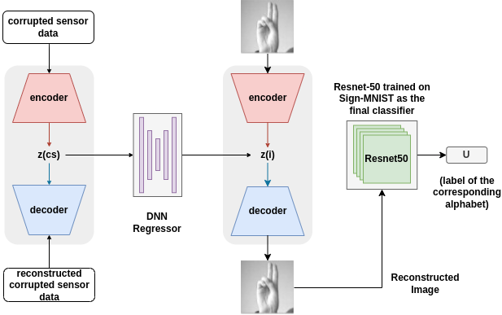

<div align="center">

# SIHeDA-Net: Sensor to Image Heterogeneous Domain Adaptation Network

**_Accepted at [MIDL 2022](https://2022.midl.io/)_**



</div>


---

> This repository is the official implementation of [SIHeDA-Net: Sensor to Image Heterogeneous Domain Adaptation Network](https://openreview.net/forum?id=zVzeKdlCMWX). 

## Requirements

To install requirements:

```setup
pip install -r requirements.txt
```


## Training

### 1. Domain A
Domain-A is the noisy/small unlabeled dataset (in our case, the sensor dataset). The code trains an encoder to map the data to the Domain-A latent space. The hyperparameters include size of the latent space (`latent_size`), mean (`mean`), standard deviation (`spread`) and number of samples per class (`num_samples`).

For generating a dataset like ours, the hyperparameters  `mean` and `spread` can be modified.

To train the model(s) in the paper, run this command:

```train
python train_da.py --input-data <path_to_data> --alpha 10 --beta 20
```


### 2. Domain B
Domain-B is the clean/large labelled dataset (in our case, the ASL image dataset - [Sign MNIST](https://www.kaggle.com/datasets/datamunge/sign-language-mnist2)). The code trains a VAE to map the image to the Domain-B latent space. The hyperparameters include size of the latent space (`latent_size`), number of samples per class (`num_samples`). It also trains an ANN classifier to predict labels, later used in end-tp-end training (3)

For generating a dataset like ours, the hyperparameters  `mean` and `spread` can be modified.

```train
python train_db.py --input-data <path_to_data> --alpha 10 --beta 20
```

### 3. End-to-end training
Trains an encoder to map Domain-A latent space and Domain-B latent space and then uses this encoder to predict labels from its output through an ANN classifier that was pre-trained on the Domain-B latent vectors (2).


```train
python train_ll.py --input-data <path_to_data> --alpha 10 --beta 20
```

## Evaluation

To evaluate my model, run:

```eval
python eval.py --model-file mymodel.pth --benchmark imagenet
```


## Pre-trained Models

You can download pretrained models here:

- [SIHeDA-Net](https://drive.google.com/mymodel.pth) trained using [Sign-MNIST](https://www.kaggle.com/datasets/datamunge/sign-language-mnist2) for Domain-B and custom sensor dataset with `mean = (-24, 23)` and `spread = 0.5` for Domain-A


## Results

Our model achieves the following performance on:

### Prediction accuracy for ASL alphabet classfication
> Using [Sign-MNIST](https://www.kaggle.com/datasets/datamunge/sign-language-mnist2) as the Domain-B dataset

| Model                   | Top 1 Accuracy  |
| ------------------      |---------------- |
| Baseline - Simple ANN   |     38.13%      |
| Ours - SIHeDA-Net       |     **70.83%**  |


## Citation

If you found our work interesting for your own research, please use the following BibTeX entry.

```bibtex
@inproceedings{
    s2022sihedanet,
    title={{SIH}e{DA}-Net: Sensor to Image Heterogeneous Domain Adaptation Network},
    author={Vignesh S and Ishikaa Lunawat and S P Sharan},
    booktitle={Medical Imaging with Deep Learning},
    year={2022},
    url={https://openreview.net/forum?id=zVzeKdlCMWX}
}
```
## Contact
For any queries, feel free to contact the authors or raise an issue.

## License

This project is open sourced under [MIT License](LICENSE).
